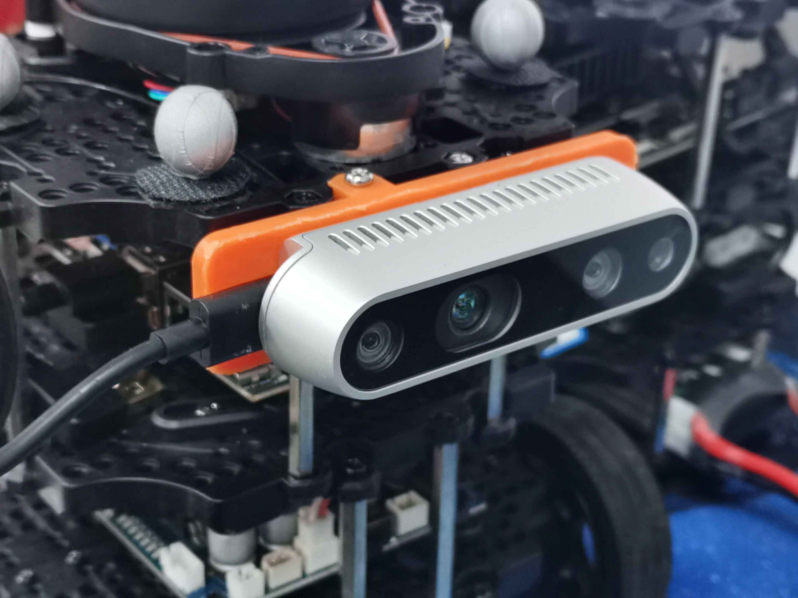

# tb3_rs
Turtlebot3 with Intel Realsense D435i

# Environment

* Turtlebot3 with Nvidia Jetson Orin
* Ubuntu 20.04
* ROS2 Foxy
* Intel Realsense D435i

# Usage

Before you use this repo, you should make sure that you have setup your turtlebot3 with ROS2 Foxy and install the realsense sdk2.0.

Follow the guide [here](https://github.com/IntelRealSense/realsense-ros?tab=readme-ov-file#installation) to install everything about realsense. 

# Holder for Realsense D435i on Turtlebot3

The Holder is open source in Onshape, you can find it [here](https://cad.onshape.com/documents/24112f12386c9f300bcb48f1/w/f9089eb5553dd3a8dba69c14/e/38a24e07db00767a4b30a8ab?renderMode=0&uiState=65af5e19f3fc09601e162a00).

